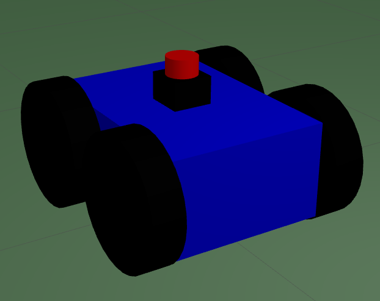
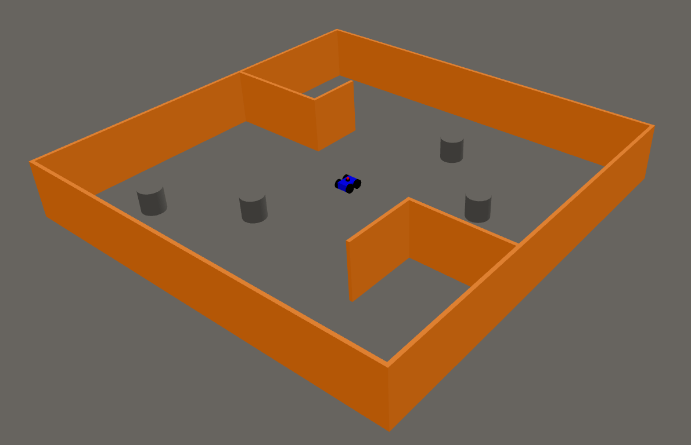
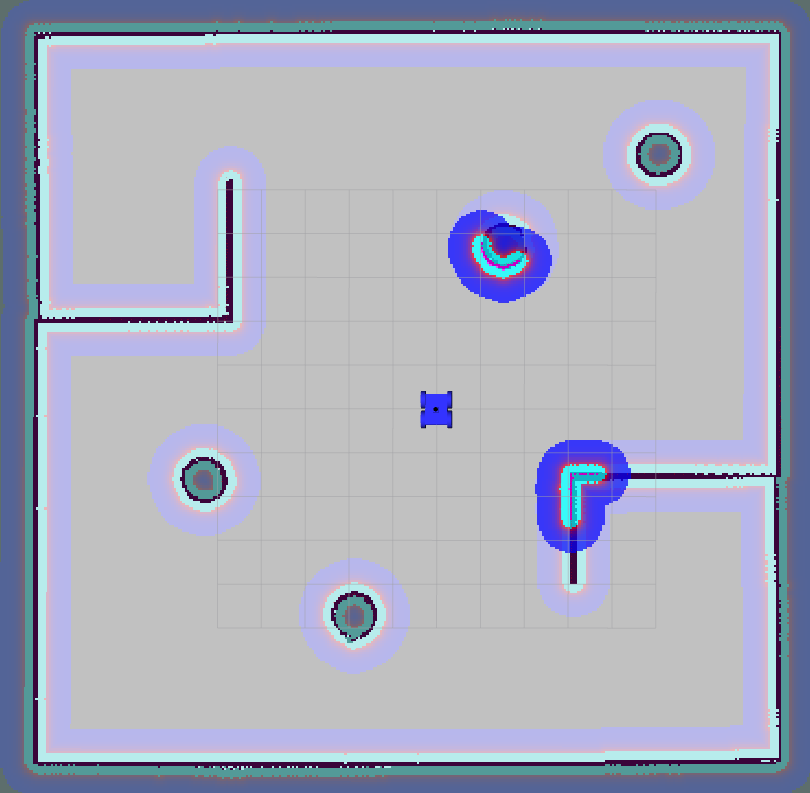
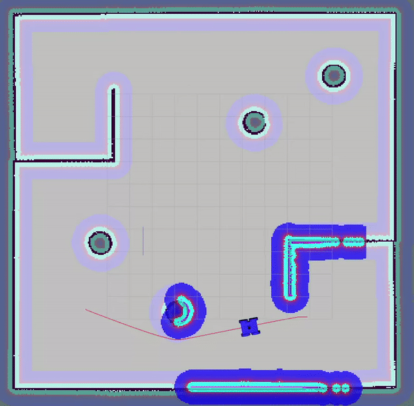

# FWS_bot

## Overview
This repository contains the ROS Noetic package for a Autonomous Mobile Robot Project.


## Features
- **Autonomous Navigation**: Utilize ROS navigation stack to enable the robot to move autonomously.
- **Localization and Mapping**: Implement SLAM (Simultaneous Localization and Mapping) using gmapping.
- **Path Planning**: Employ global and local path planning algorithms for efficient navigation.
- **Visualization**: Use RViz for real-time visualization of the robot's state and environment.


## Robot Model
 
## Gazebo World

## Rviz Map

## Robot Navigation



## Directory Structure
```bash
FWS_bot/
 └── src/
      └── mybot/
            ├── config/
            │    └── mybot.rviz
            ├── images/
            │   ├── Robot_Navigation.gif
            │   ├── gazebo_world.png
            │   ├── robot.png
            │   └── rviz_map.png
            ├── launch/
            │   ├── all.launch
            │   ├── amcl.launch
            │   ├── cmd_vel.launch
            │   ├── move_base.launch
            │   ├── mybot_gmapping.launch
            │   ├── rviz.launch
            │   └── simplemap.launch
            ├── maps/
            │   ├── map.pgm
            │   ├── map.yaml
            │   ├── map2.pgm
            │   └── map2.yaml
            ├── param/
            │   ├── base_local_planner_params.yaml
            │   ├── costmap_common_params.yaml
            │   ├── global_costmap_params.yaml
            │   └── local_costmap_params.yaml
            ├── scripts/
            │    └── cmd_vel.py
            ├── urdf/
            │   ├── lidar.xacro
            │   ├── robot.urdf.xacro
            │   ├── robot_colors.xacro
            │   └── skid_steering.xacro
            ├── worlds/
            │    └── myworld.world
            ├── CMakeLists.txt
            ├── package.xml
            └── README.md
```

## Dependencies
Before running the project, ensure you have the following dependencies installed:
- ROS Noetic
- gmapping
- move_base
- AMCL 
- RViz
- URDF
- XACRO


```bash
sudo apt-get update

sudo apt-get install ros-noetic-gmapping

sudo apt-get install ros-noetic-navigation

sudo apt-get install ros-noetic-amcl
```

## Running Instructions
To start the robot with all necessary nodes, use the following commands:

**Step 1:** Clone the Project
```bash
git clone https://github.com/abdullaxahmed/FWS_bot.git

cd FWS_bot
```
**Step 2:** Build the Workspace
```bash
catkin_make
```
**Step 3:** Sourcing the Workspace
```bash
source devel/setup.bash
```
**Step 4:** Launching the Project

```bash
roslaunch mybot all.launch
```

